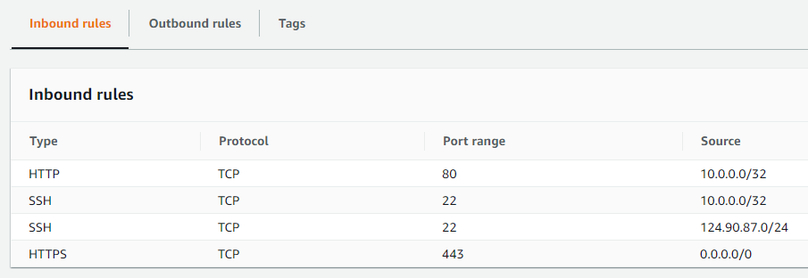

## Written answer:

1. What is the big deal about an API key being publicly readable (such as existing in a public repository)?

    - API keys are created for the application we are connecting to.  These keys are granted certain right / permission level to perform actions in conjunction with an API.  If the key is made public, anyone with a copy of the key has the same rights.  In the case of the Discord Bot, is the key is made public, anyone can read and write messages via API calls on my Discord server / guild.

2. Describe a situation that would cause a merge conflict.

    - Change exists on remote repository (such as on GitHub) to file(s) also edited on local repository.
    - Change exists on one branch to file(s) that have also been edited on another branch

3. What is the purpose of `~/.ssh/authorized_keys`?

    - The `authorized_keys` file, located in the `.ssh` folder of the users home directory holds all public keys allowed to connect to the system as that username.  If a user `bob` existed on the system in addition to `sue` the two users could have entirely different contents in their `authorized_keys` file - ie. different sets of public keys.

4. Given the following command:
```
ssh -i my-key.pem bob@34.233.188.204 
```
The following error is generated:
```
bob@34.233.188.204: Permission denied (publickey).
```
Describe at least one possible issue based on the error.

    - Error was generated specifically by using the wrong username to log in - when server side authorized_keys file was checked in /home/bob/.ssh, there was no matching public key for the given private key
    - No matching public key for the given private key - wrong key
    - Unprotected private key (permissions too open)
    - Wrong user name
    - Misnamed files on server side

5. Using either background jobs or screen, describe how the script `without-me` can be run independent of my terminal connection to the system.
    - TODO: finish grading

6. Given the following Security Group configuration, describe how the inbound rules are configured and any implications of these rules (access to x is only allowed by a, b, c)

    - Access to port 80 (HTTP) is only allowed by internal subnet 10.0.0.0/32
    - Access to port 22 (SSH) is allowed by internal subnet 10.0.0.0/32 AND external subnet 124.90.87.0/24
    - Access to port 443 (HTTPS) is allowed by the world: 0.0.0.0/0
    - Side note: 10.0.0.0/32 was a really silly rule.  Why?


## Written commands / code

1. My local repository has been switched to a branch called `addons` where I have made some changes to files and made commits of my work. Write the commands needed to merge the `addons` branch with my main branch.
    
    - Setup:
        - `git checkout -b addons`
        - `vim existing-file.txt`
        - `git commit -m "Made improvements"`
    - `git checkout main`
    - `git merge addons`
    - Afterwards:
        - `git push`

2. What command can I use to view process logs?  You can reference ssh in your answer to provide context / usage.

    - `systemctl status ssh` `journalctl ssh`
    - 
    - Referencing `\var\log\` received 80%.  Its a directory, not a command that views logs for a given service

3. Given a CIDR notation for a subnet of 134.23.24.89/8, what is the corresponding subnet mask?

    - 255.0.0.0

4. Write the CIDR notation given an IP address on a subnet of 164.21.34.23 and a subnet mask of 255.255.255.0
    
    - 164.21.34.23/24

## Fill in the blank

1. I have files that I would like to make sure git doesn`t track, even if I attempt to accidentally add them.  The files can be listed in a _____ file in my repository.  git will look at the file and ignore based on the list of files in the file.

    - `.gitignore`

2. A ____ template is a way to create AWS infrastructure as code.  Using this template, AWS tools such as VPCs, subnets, security groups, and EC2 instances can be written out with default values instead of interacting with each menu.  Using a template will create a `stack` on AWS based on the configuration written.

    - `CloudFormation`

3. _____ is the python package manager.
    
    - `pip` or `pip3`

4. To create a new user on a Linux system use the command ____

    - `adduser`
    - `useradd` was also accepted, but we should look at the difference between the two

5. To create a script that triggers when `git commit` is run in a repository, in the `.git/hooks` directory I can place a script named ____

    - `pre-commit`, `post-commit`
    - Strange other ones: `prepare-commit-msg`, `commit-msg`


## True / False

1. To add a new file created on my local repo to the remote repo, I need to `push`, then `add`, then `commit` in that order.

    - False.  If a new file is created, it needs to be `add`ed for tracking, then changes need to be `commit`ed, then the changes can be `push`ed to GitHub

2. EC2 instances must be connected to a VPC in order to provide network access.

    - True.  And EC2 instance not connected to a VPC has no way to recieve network traffic.

3. HTTPS is bound to port 80 by default.
    
    - False.  HTTPS is bound to port 443 by default

4. Security Group inbound rules for the VPC need to be created before I can access an EC2 instance on the VPC externally.
    
    - True.  By default, security groups do not allow any inbound traffic.  We need to create at least a valid inbound traffic rule to access systems remotely


