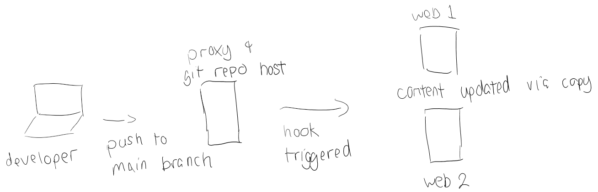

# Extra Credit Project

This extra credit is based on a working version of Project 3, in which you set up a proxy server and two web servers.  If that infrastrucutre is set up, implement the following CI/CD workflow using hooks.  Note that this extra credit project is not all or nothing.  You can receive partial credit for the work you get done if documentated.

## Documentation Deliverable
- Project documentation should be in your `AWS` folder in your repository for the course in a file named `ci-hooks.md`

## Task List

1. On the proxy server, initialize a git repository - it is recommended to have this repo be a workspace (not a bare repo) for ease of use within your hook.  You can choose for the repo to be under the `git` username or the default `ubuntu` username.  Keep your design decision in mind here, as it may have consequences on permissions down the line.
    - Hint: recall that ssh keypairs may be an issue here if you go the `git` user route.

2. Push your website contents to the git repo on the proxy server.  It may be logically convenient to put them in a folder named `html`  
    - **Deliverable**:
    - Screenshot pushing content to the git repo on the proxy server as well as a screenshot of the content updated on the proxy server.    

3. Modify the permissions of the `/var/www/html/` folder on both webservers so that the appropriate user can write to the `html` folder.
    - Hint: this pairs back to who owns the repo on the proxy server.  If you made a `git` user, a `git` user also needs to exists on the webservers and they need permission to modify the `html` folder as the hook would be run as them.  If it is the `ubuntu` user, you still need to worry about permission, but don't need to create a new user.  Remember that on the webservers, if you don't want `root` to be part of the folder permission set, apache2 still needs access via the `www-data` group.
    - **Deliverable**:
    - Screenshot of the `html` folder's permissions on one of the webservers using `ls -lah`.

4. Set up a hook in the git repo on the proxy server.  Reference [post-receive](post-receive) for the base code.  You are going to modify the code so that instead of having it copy files to the local directory, you are going to copy files to the webservers.
    - Hints: 
        - You will want to replace this line: `git --work-tree=$TARGET --git-dir=$GIT_DIR checkout -f $BRANCH` with a line that will copy files from the repo folder to the folder on the webservers.  Investigate `scp` and maybe `rsync` for "touchfree" copying of files.
        - It may be wise to play with `scp` / `rsnyc` on the command line first to see if you need to deal with ssh key pairs between the proxy and the webservers.
    - **Deliverables**:
    - Put your working hook contents into your `AWS` folder of your class repository.
    - Screenshot(s) of your final workflow
        - Developer pushes content to `main` branch of repo hosted on proxy
        - Developer sees message(s) that the `post-receive` hook triggered
        - Both sites are updated with the content hosted by the git repo on the proxy

## Submission

In your GitHub repository, select the green `Code` button then select `Download ZIP`. Upload this zip file to Pilot.

In the `Comment` area in the Pilot Dropbox, copy URL / link to the repository corresponding to the project you are submitting